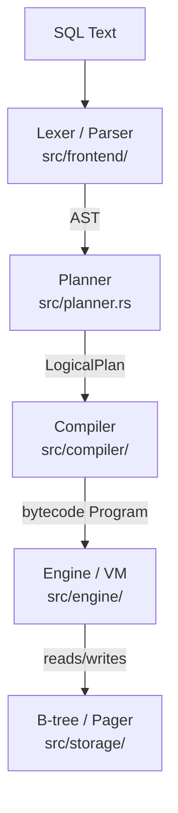

# database

> A single-file relational database engine written in Rust, built from scratch.


A hobby implementation of a relational database similar to SQLite. It includes a hand-written SQL parser, query planner, bytecode compiler, register-based virtual machine, and a custom B-tree storage engine with page-based file I/O. Data persists across restarts in a single `.db` file.

## Features

### SQL

| Feature | Status |
|---------|--------|
| `CREATE TABLE` | ✓ |
| `INSERT INTO … VALUES` (multi-row) | ✓ |
| `INSERT INTO … SELECT` | ✓ |
| `SELECT` with column list / `SELECT *` | ✓ |
| `WHERE` (comparisons, `AND`, `OR`, `NOT`) | ✓ |
| `ORDER BY` (`ASC` / `DESC`, multi-column) | ✓ |
| `GROUP BY` | ✓ |
| `HAVING` | ✓ |
| `DISTINCT` | ✓ |
| `LIMIT` | ✓ |
| `COUNT(*)` / `COUNT(col)` aggregates | ✓ |
| `SUM`, `MIN`, `MAX` aggregates | ✓ |
| `DELETE FROM … WHERE` | ✓ |
| `UPDATE … SET … WHERE` | ✓ |
| `CREATE INDEX` (single- and multi-column, `INTEGER` / `TEXT`) | ✓ |
| Index-accelerated equality and range scans | ✓ |
| Multi-column index prefix scans | ✓ |
| `EXPLAIN` query plans | ✓ |
| `DROP TABLE` | — |
| `JOIN`s | — |
| `NULL` / `IS NULL` | — |
| Subqueries | — |

### Storage

- Custom B-tree engine with CBOR-encoded rows
- Page-based file format (4 KB pages), overflow chains for large values
- Secondary indexes as separate B-trees
- Persistent storage — survives process restart

### Testing

- Unit, integration, and SQL end-to-end tests (`cargo test`)
- Inline SQL test harness: `.sql` files with `-- >` expected-output lines
- Property-based tests for B-tree invariants (proptest)

## Quick Start

```bash
git clone https://github.com/jameswp/database
cd database
cargo run -- mydb.db
```

```
db> enter sql
sql> CREATE TABLE users (id INTEGER, name TEXT, age INTEGER)
Table 'users' created
sql> INSERT INTO users VALUES (1, 'alice', 30), (2, 'bob', 25), (3, 'carol', 35)
3 rows inserted
sql> SELECT * FROM users WHERE age > 27 ORDER BY name
┌────┬───────┬─────┐
│ id │ name  │ age │
├────┼───────┼─────┤
│ 1  │ alice │ 30  │
│ 3  │ carol │ 35  │
└────┴───────┴─────┘
```

## Build & Test

```bash
cargo build              # Debug build
cargo build --release    # Release build
cargo test               # Run all tests
cargo test test_sql_     # SQL integration tests only
cargo run -- <db_file>   # Interactive REPL
```

## Architecture



**Frontend** (`src/frontend/`) tokenizes SQL and produces an AST. The **Planner** (`src/planner.rs`) converts the AST into a logical plan, choosing index scans over full-table scans when a usable index exists. The **Compiler** (`src/compiler/`) lowers the logical plan to a register-based bytecode program, and the **Engine** (`src/engine/`) executes it. The **B-tree / Pager** (`src/storage/`) persists rows in a 4 KB paged file using CBOR encoding with overflow chains for large values.

## Interactive REPL

### SQL mode (enter sql)


```
db> SELECT name, age FROM users WHERE age > 20 ORDER BY age DESC
┌───────┬─────┐
│ name  │ age │
├───────┼─────┤
│ carol │ 35  │
│ alice │ 30  │
│ dave  │ 28  │
└───────┴─────┘
```

### Bytecode Compilation


### EXPLAIN and indexes


The planner emits an `IndexScan` node when a `WHERE col = value` filter matches an available index:

```
sql> CREATE INDEX idx_age ON users (age)
Index 'idx_age' created
sql> EXPLAIN SELECT * FROM users WHERE age = 30
0 │ "Project [id:0, name:1, age:2]"
1 │ "  RowidLookup users [cols: id, name, age]"
2 │ "    IndexScan via idx_age [= 30]"
```

### Debug modes

TUI Debugger:


REPL:
```
db> modes
Available modes:
  btree    - B-tree storage operations
  parser   - SQL lexer and parser inspection
  planner  - Query planning and logical plans
  engine   - VM bytecode execution
```

| Mode | Purpose |
|------|---------|
| `btree` | Inspect B-tree pages, cursors, raw data |
| `parser` | Tokenize and parse SQL; show AST |
| `planner` | Show logical plan for a query |
| `engine` | Compile to bytecode and inspect program |

### Non-interactive usage

```bash
cargo run -- mydb.db sql "SELECT * FROM users"
cargo run -- mydb.db parser parse "SELECT id FROM users WHERE age > 18"
cargo run -- mydb.db planner plan "SELECT name FROM users WHERE id = 1"
cargo run -- mydb.db btree inspect all
```

### Running a SQL script file

Use `file` mode to execute a `.sql` script containing multiple statements. Statements are split on `;`; `--` line comments and `/* */` block comments are stripped before execution.

```bash
cargo run -- mydb.db file path/to/script.sql
```

This is how the sakila sample database is loaded:

```bash
# Strip triggers/views, then load schema and data
make sakila-schema-stripped.sql
cargo run --release -- sakila.db file sakila-schema-stripped.sql
cargo run --release -- sakila.db file path/to/sqlite-sakila-insert-data.sql

# Or with the Makefile target (clones sakila repo automatically if ../sakila is absent):
make test-sakila
```

## References

- B-tree design: https://cglab.ca/~abeinges/blah/rust-btree-case/
- SQLite file format: https://www.sqlite.org/fileformat.html
