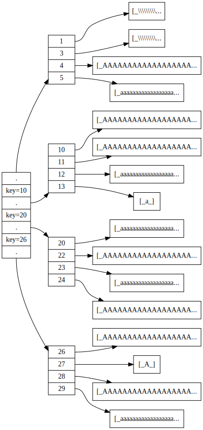

# Documentation

## Example of btree with two layers
The top layer is an intermediate node.

The second layers contains the leaf nodes of the tree.

The last node represents the values. (in reality these are stored inside the leaf nodes)

